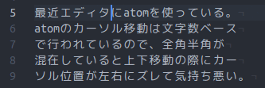
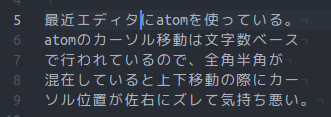

# multibyte-updown package

moves cursors up and down vertically as far as possible, even if a buffer contains various width of characters.

文章中に全角半角が混在していても、上下矢印キーを押した際に可能な限り垂直方向にカーソルを移動します。

before  

after  

